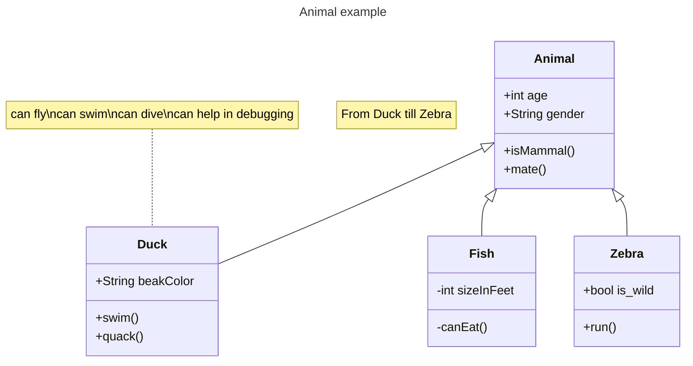

# 实验七 Python面向对象编程
班级： 21计科1

学号： B20230302127

姓名： 刘嘉伟

Github地址：<https://github.com/PigeonDuck/python_course>

CodeWars地址：<https://www.codewars.com/users/DuckPigeon>

---

## 实验目的

1. 学习Python类和继承的基础知识
2. 学习namedtuple和DataClass的使用

## 实验环境

1. Git
2. Python 3.10
3. VSCode
4. VSCode插件

## 实验内容和步骤

### 第一部分

Python面向对象编程

完成教材《Python编程从入门到实践》下列章节的练习：

- 第9章 类

---

### 第二部分

在[Codewars网站](https://www.codewars.com)注册账号，完成下列Kata挑战：

---

#### 第一题：面向对象的海盗

难度： 8kyu

啊哈，伙计!

你是一个小海盗团的首领。而且你有一个计划。在OOP的帮助下，你希望建立一个相当有效的系统来识别船上有大量战利品的船只。
对你来说，不幸的是，现在的人很重，那么你怎么知道一艘船上装的是黄金而不是人呢？

你首先要写一个通用的船舶类。

```python
class Ship:
    def __init__(self, draft, crew):
        self.draft = draft
        self.crew = crew
```

每当你的间谍看到一艘新船进入码头，他们将根据观察结果创建一个新的船舶对象。

- `draft`吃水 - 根据船在水中的高度来估计它的重量
- `crew`船员 - 船上船员的数量

`Titanic = Ship(15, 10)`

任务

你可以访问船舶的 "draft(吃水) "和 "crew(船员)"。"draft(吃水) "是船的总重量，"船员 "是船上的人数。
每个船员都会给船的吃水增加1.5个单位。如果除去船员的重量后，吃水仍然超过20，那么这艘船就值得掠夺。任何有这么重的船一定有很多战利品!
添加方法
`is_worth_it`
来决定这艘船是否值得掠夺。

例如：

```python
Titanic.is_worth_it()
False
```

祝你好运，愿你能找到金子!

代码提交地址：
<https://www.codewars.com/kata/54fe05c4762e2e3047000add>

---

#### 第二题： 搭建积木

难度：7kyu

写一个创建Block的类（Duh.）
构造函数应该接受一个数组作为参数，这个数组将包含3个整数，其形式为`[width, length, height]`，Block应该由这些整数创建。

定义这些方法:

- `get_width()` return the width of the `Block`
- `get_length()` return the length of the `Block`
- `get_height()` return the height of the `Block`
- `get_volume()` return the volume of the `Block`
- `get_surface_area()` return the surface area of the `Block`

例子：

```python
b = Block([2,4,6]) # create a `Block` object with a width of `2` a length of `4` and a height of `6`
b.get_width() # return 2    
b.get_length() # return 4
b.get_height() # return 6
b.get_volume() # return 48
b.get_surface_area() # return 88
```

注意： 不需要检查错误的参数。

代码提交地址：
<https://www.codewars.com/kata/55b75fcf67e558d3750000a3>

---

#### 第三题： 分页助手

难度：5kyu

在这个练习中，你将加强对分页的掌握。你将完成PaginationHelper类，这是一个实用类，有助于查询与数组有关的分页信息。
该类被设计成接收一个值的数组和一个整数，表示每页允许多少个项目。集合/数组中包含的值的类型并不相关。

下面是一些关于如何使用这个类的例子：

```python
helper = PaginationHelper(['a','b','c','d','e','f'], 4)
helper.page_count() # should == 2
helper.item_count() # should == 6
helper.page_item_count(0)  # should == 4
helper.page_item_count(1) # last page - should == 2
helper.page_item_count(2) # should == -1 since the page is invalid

# page_index takes an item index and returns the page that it belongs on
helper.page_index(5) # should == 1 (zero based index)
helper.page_index(2) # should == 0
helper.page_index(20) # should == -1
helper.page_index(-10) # should == -1 because negative indexes are invalid
```

代码提交地址：
<https://www.codewars.com/kata/515bb423de843ea99400000a>


---

#### 第四题： 向量（Vector）类

难度： 5kyu

创建一个支持加法、减法、点积和向量长度的向量（Vector）类。

举例来说：

```python
a = Vector([1, 2, 3])
b = Vector([3, 4, 5])
c = Vector([5, 6, 7, 8])

a.add(b)      # should return a new Vector([4, 6, 8])
a.subtract(b) # should return a new Vector([-2, -2, -2])
a.dot(b)      # should return 1*3 + 2*4 + 3*5 = 26
a.norm()      # should return sqrt(1^2 + 2^2 + 3^2) = sqrt(14)
a.add(c)      # raises an exception
```

如果你试图对两个不同长度的向量进行加减或点缀，你必须抛出一个错误。
向量类还应该提供：

- 一个 `__str__` 方法，这样 `str(a) === '(1,2,3)'` 
- 一个equals方法，用来检查两个具有相同成分的向量是否相等。

注意：测试案例将利用用户提供的equals方法。

代码提交地址：
<https://www.codewars.com/kata/526dad7f8c0eb5c4640000a4>

---

#### 第五题： Codewars风格的等级系统

难度： 4kyu

编写一个名为User的类，用于计算用户在类似于Codewars使用的排名系统中的进步量。

业务规则：

- 一个用户从等级-8开始，可以一直进步到8。
- 没有0（零）等级。在-1之后的下一个等级是1。
- 用户将完成活动。这些活动也有等级。
- 每当用户完成一个有等级的活动，用户的等级进度就会根据活动的等级进行更新。
- 完成活动获得的进度是相对于用户当前的等级与活动的等级而言的。
- 用户的等级进度从零开始，每当进度达到100时，用户的等级就会升级到下一个等级。
- 在上一等级时获得的任何剩余进度都将被应用于下一等级的进度（我们不会丢弃任何进度）。例外的情况是，如果没有其他等级的进展（一旦你达到8级，就没有更多的进展了）。
- 一个用户不能超过8级。
- 唯一可接受的等级值范围是-8,-7,-6,-5,-4,-3,-2,-1,1,2,3,4,5,6,7,8。任何其他的值都应该引起错误。

逻辑案例：

- 如果一个排名为-8的用户完成了一个排名为-7的活动，他们将获得10的进度。
- 如果一个排名为-8的用户完成了排名为-6的活动，他们将获得40的进展。
- 如果一个排名为-8的用户完成了排名为-5的活动，他们将获得90的进展。
- 如果一个排名-8的用户完成了排名-4的活动，他们将获得160个进度，从而使该用户升级到排名-7，并获得60个进度以获得下一个排名。
- 如果一个等级为-1的用户完成了一个等级为1的活动，他们将获得10个进度（记住，零等级会被忽略）。

代码案例：

```python
user = User()
user.rank # => -8
user.progress # => 0
user.inc_progress(-7)
user.progress # => 10
user.inc_progress(-5) # will add 90 progress
user.progress # => 0 # progress is now zero
user.rank # => -7 # rank was upgraded to -7
```

代码提交地址：
<https://www.codewars.com/kata/51fda2d95d6efda45e00004e>

---

### 第三部分

使用Mermaid绘制程序的**类图**

安装VSCode插件：

- Markdown Preview Mermaid Support
- Mermaid Markdown Syntax Highlighting

使用Markdown语法绘制你的程序绘制程序类图（至少一个），Markdown代码如下：


显示效果如下：



查看Mermaid类图的语法-->[点击这里](https://mermaid.js.org/syntax/classDiagram.html)

使用Markdown编辑器（例如VScode）编写本次实验的实验报告，包括[实验过程与结果](#实验过程与结果)、[实验考查](#实验考查)和[实验总结](#实验总结)，并将其导出为 **PDF格式** 来提交。

## 实验过程与结果

### 第一题：面向对象的海盗
```python
class Ship:
    def __init__(self, draft, crew):
        self.draft = draft
        self.crew = crew
    # Your code here
    def is_worth_it(self):
        if self.draft-self.crew*1.5>20 :
            return True
        else:
            return False
# EmptyShip =Ship(51,20)
# print(EmptyShip.is_worth_it())
```
### 第二题： 搭建积木
```python
class Block:
    # Good Luck!
    def __init__(self,WLH):
        self.WLH = WLH
    def get_width(self):
        return self.WLH[0]
    def get_length(self):
        return self.WLH[1]
    def get_height(self):
        return self.WLH[2]
    def get_volume(self):
        return self.WLH[0]*self.WLH[1]*self.WLH[2]
    def get_surface_area(self):
        area=self.WLH[0]*self.WLH[1]*2
        area1 =self.WLH[1]*self.WLH[2]*2
        area2 = self.WLH[0]*self.WLH[2]*2
        return area+area1+area2
```
### 第三题： 分页助手
```python
class PaginationHelper:
    
    # The constructor takes in an array of items and an integer indicating
    # how many items fit within a single page
    def __init__(self, collection, items_per_page):
        self.collection =collection
        self.items_per_page=items_per_page
        count = 0
        self.str_len = []
        for i in range(0,len(self.collection)):
            if count <= self.items_per_page:   
               count+=1
            if count == self.items_per_page:
               self.str_len.append(count)
               count=0
            if i == len(self.collection)-1:
               self.str_len.append(count)
        

    # returns the number of items within the entire collection
    def item_count(self):
        length=len(self.collection)
        return length

    # returns the number of pages
    def page_count(self):
        page_count = len(self.str_len)
        return page_count
    
    # returns the number of items on the given page. page_index is zero based
    # this method should return -1 for page_index values that are out of range
    def page_item_count(self, page_index):

        if page_index > self.page_count()-1 or page_index < 0:  #2  1
           return -1
        #分配页数
        return self.str_len[page_index]
            
    # determines what page an item at the given index is on. Zero based indexes.
    # this method should return -1 for item_index values that are out of range
    def page_index(self, item_index):
        if item_index<0:
            return -1
        if item_index > len(self.collection)-1:
            return -1
        if item_index == self.items_per_page-1 :
            return 0
        return item_index//self.items_per_page
```
### 第四题： 向量（Vector）类
```python
class Vector:

    def __init__(self,vector):
        self.vector = vector

    def equals(self,vector2):
       if len(self.vector)!=len(vector2.vector): return False
       for i in range(0, len(self.vector)):
           if self.vector[i] !=vector2.vector[i]:
            return False
       return True
    
    def __str__(self):
        return str(tuple(self.vector)).replace(" ", "")
    
    def add(self,vector2):
       if len(self.vector)!=len(vector2.vector): raise Exception()
       result=[]
       for i in range(0,len(self.vector)):
         result.append(vector2.vector[i]+self.vector[i])
       
       x = Vector(result)
       return x
    
    def subtract(self,vector2):
       if len(self.vector)!=len(vector2.vector): raise Exception()
       result=[]
       for i in range(0,len(self.vector)):
         result.append(-(vector2.vector[i]-self.vector[i]))

       x = Vector(result)
       return x
    
    def dot(self,vector2):
       if len(self.vector)!=len(vector2.vector): raise Exception()
       self.result=[]
       sum = 0
       for i in range(0,len(self.vector)):
         self.result.append(vector2.vector[i]*self.vector[i])
         sum = sum +self.result[i]
       return sum
    
    def norm(self):
       sum = 0
       for i in range(0,len(self.vector)):
         sum = sum +self.vector[i]**2
       return (sum)**0.5
    
    def __str__(self):
        return str(tuple(self.vector)).replace(" ", "")
```
### 第五题： Codewars风格的等级系统
```python
class User:
    rank = -8
    progress = 0

    def inc_progress(self, rank):
        if rank < -8 or rank == 0 or 8 < rank:
            raise
        diff = rank - (rank > 0) - self.rank + (self.rank > 0)
        if diff < -1:
            return
        self.progress += {-1: 1, 0: 3}.get(diff, 10 * diff ** 2)
        while self.progress >= 100 and self.rank < 8:
            self.progress -= 100
            self.rank += 1 + (self.rank == -1)

        if self.rank == 8:
            self.progress = 0
```

**注意：不要使用截图，Markdown文档转换为Pdf格式后，截图可能会无法显示。**

## 实验考查

请使用自己的语言并使用尽量简短代码示例回答下面的问题，这些问题将在实验检查时用于提问和答辩以及实际的操作。

1. Python的类中__init__方法起什么作用？  
   >__init__方法能起到初始化的作用，能够在创建对象的时候就能够自动地调用该函数
2. Python语言中如何继承父类和改写（override）父类的方法。  
   （1）继承父类的方式：
   ```python
    class Father():

    class Son(Father):
   ```
   （2）改写父类的方法
   ```python
    class Father():
        def A_method():
            return 'Father'

    class Son(Father):
        def A_method():
            return 'Son'
   ```
   
3. Python类有那些特殊的方法？它们的作用是什么？请举三个例子并编写简单的代码说明。  

Python类有许多特殊方法（也称为魔术方法或双下划线方法），它们以双下划线开头和结尾。这些方法提供了一种自定义类行为的方式。以下是三个常用的特殊方法及其作用的示例代码：

1. `__init__()`：初始化方法，在创建对象时调用，用于设置对象的初始状态。

```python
class Person:
    def __init__(self, name):
        self.name = name

person = Person("Alice")
print(person.name)  # 输出: Alice
```

2. `__str__()`：字符串表示方法，用于返回对象的字符串表示，方便输出和调试。

```python
class Point:
    def __init__(self, x, y):
        self.x = x
        self.y = y

    def __str__(self):
        return f"Point({self.x}, {self.y})"

point = Point(2, 3)
print(point)  # 输出: Point(2, 3)
```

3. `__len__()`：长度方法，用于返回对象的长度或元素个数。

 ```python
class MyList:
    def __init__(self, items):
        self.items = items

    def __len__(self):
        return len(self.items)

my_list = MyList([1, 2, 3, 4, 5])
print(len(my_list))  # 输出: 5
```
## 实验总结
通过学习Python类，我掌握了特殊方法的使用，能够自定义对象的初始化、字符串表示和长度等行为，提升了代码的可读性和灵活性，收获颇多。